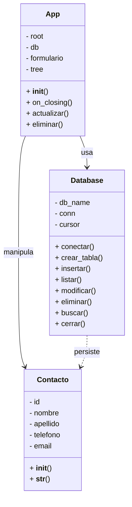

# Evidencia de Aprendizaje N° 2

**Análisis y Diseño del Sistema ABMC de Contactos**

**Autor:** [Luis Alberto Lagger - Fernando Areosa]  
**Asignatura:** Innovación y Gestión de Datos  
**Profesores:** [Carlos Charletti - Ramiro Adrián Ceballes]  
**Fecha de Entrega:** Hasta el 17 de septiembre de 2025

---


---

## Instalador

Para la instalación del sistema ejecutable en windows se dispone del siguiente instalador:

[Click aquí para descargar](https://drive.google.com/file/d/1B06Xxp0Ywgqoo7_n9pbPmN_Z2dLpdUyl/view?usp=sharing)

---

## Índice

- [1. Modelo de Clases](#1-modelo-de-clases)
  - [1.1. Diagrama UML](#11-diagrama-uml)
  - [1.2. Explicación de Relaciones](#12-explicación-de-relaciones)
- [2. Base de Datos](#2-base-de-datos)
- [3. Lenguajes y Paradigmas Utilizados](#3-lenguajes-y-paradigmas-utilizados)
  - [3.1. Programación Orientada a Objetos (POO)](#31-programación-orientada-a-objetos-poo)
  - [3.2. Lenguaje de Consultas SQL](#32-lenguaje-de-consultas-sql)
- [4. Conexión de la Base de Datos con el Programa](#4-conexión-de-la-base-de-datos-con-el-programa)

---

## 1. Modelo de Clases

El diseño del sistema se basa en el paradigma de la **Programación Orientada a Objetos (POO)**, que permite estructurar el código de manera modular y reutilizable. El proyecto está organizado en diferentes clases y módulos para separar responsabilidades y facilitar su mantenimiento.

Las clases principales son:

- **Clase Contacto** (en _models.py_): Modela un contacto individual con atributos como `id`, `nombre`, `apellido`, `telefono` y `email`. Incluye un constructor (`__init__`) y el método `__str__` para representar al objeto como texto.
- **Clase Database** (en _database.py_): Encapsula la lógica de conexión, almacenamiento y recuperación de datos en **SQLite**. Administra la creación de tablas, inserción, consulta, modificación y eliminación de registros. El uso de placeholders `(?, ?)` en las sentencias SQL asegura la prevención de inyecciones de código.
- **Clase App** (en _gui.py_): Representa la interfaz gráfica de usuario (GUI). Es el puente entre el usuario y la base de datos. Por ejemplo, al presionar un botón en la interfaz, se ejecuta un método de `Database` que manipula objetos `Contacto` sin que la GUI necesite conocer la lógica SQL subyacente.

---

### 1.1. Diagrama UML



---

### 1.2. Explicación de Relaciones

- **App y Database (Agregación):**  
  La clase `App` incluye una instancia de la clase `Database`. Esta relación indica que la aplicación necesita la base de datos para funcionar, pero ambas pueden existir de manera independiente.

- **App y Contacto (Dependencia):**  
  La clase `App` crea y gestiona objetos de la clase `Contacto`. La dependencia se da porque `App` utiliza la información de los contactos para operar.

- **Database y Contacto (Asociación):**  
  La clase `Database` interactúa directamente con instancias de la clase `Contacto`, almacenando y recuperando sus datos en la base de datos.

---

## 2. Base de Datos

La base de datos utilizada es SQLite y se denomina **contactos.db**. Se implementa una tabla llamada **Contactos** con los siguientes campos:

| Campo    | Tipo    | Descripción                                   |
| -------- | ------- | --------------------------------------------- |
| id       | INTEGER | Identificador único de cada contacto (PK).    |
| nombre   | TEXT    | Nombre del contacto.                          |
| telefono | TEXT    | Número de teléfono del contacto.              |
| email    | TEXT    | Dirección de correo electrónico del contacto. |

---

## 3. Lenguajes y Paradigmas Utilizados

### 3.1. Programación Orientada a Objetos (POO)

La POO es un paradigma que organiza el código en **clases y objetos**, facilitando la reutilización y el mantenimiento.

En este sistema:

- **Clase `Contacto`:** Modela los datos y comportamientos de un contacto individual.
- **Clase `Database`:** Encapsula la lógica de conexión y operaciones con la base de datos.
- **Clase `App`:** Coordina las acciones de la aplicación, gestionando la interacción entre contactos y base de datos.

### 3.2. Lenguaje de Consultas SQL

Se emplea **SQL** para interactuar con la base de datos. Los principales tipos de comandos utilizados son:

- **DDL (Lenguaje de Definición de Datos):** Define la estructura de la base de datos.

  - Ejemplo:
    ```sql
    CREATE TABLE Contactos (
        id INTEGER PRIMARY KEY AUTOINCREMENT,
        nombre TEXT NOT NULL,
        telefono TEXT NOT NULL,
        email TEXT NOT NULL
    );
    ```

- **DML (Lenguaje de Manipulación de Datos):** Permite insertar, modificar y eliminar datos.

  - Ejemplo (usando placeholders en Python con `sqlite3`):
    ```python
    cursor.execute("INSERT INTO Contactos (nombre, telefono, email) VALUES (?, ?, ?)", (nombre, telefono, email))
    ```

- **DCL (Lenguaje de Control de Datos):** Aunque SQLite no implementa gestión de usuarios como otros motores, en teoría este tipo de comandos controla permisos de acceso a la base de datos.

---

## 4. Conexión de la Base de Datos con el Programa

La conexión entre Python y SQLite se realiza con el módulo **`sqlite3`**.  
La secuencia de pasos es la siguiente:

1. **Importar la librería:**
   ```python
   import sqlite3
   ```

---

2. **Establecer conexión con la base de datos:**

```python
conexion = sqlite3.connect("contactos.db")
```

3. **Crear un cursor para ejecutar sentencias SQL:**
   ```python
   cursor = conexion.cursor()
   ```

---

4. **Ejecutar comandos SQL (ejemplo con INSERT):**

```python
cursor.execute("INSERT INTO Contactos (nombre, telefono, email) VALUES (?, ?, ?)", (nombre, telefono, email))
```

5. **Guardar los cambios en la base de datos:**
   ```python
   conexion.commit()
   ```

---
